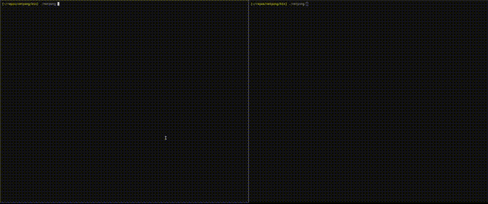

# Netpong: Networked Multiplayer Pong with Client Side Prediction and Server Reconciliation

This is a simple version of Pong which targets X11 on Linux and uses OpenGL for rendering. It was written as a learning project, and I achieved the following goals:
- Implemented networked multiplayer code directly on top of Unix UDP sockets. Uses client side prediction, server side reconciliation, and visual interpolation
- Included simple macros for simulating different network conditions, including packet loss and latency
- Improved my practices for cross platform project architecture, opting for a small number of translation units, each one standing for a different component (i.e. platform, renderering backend, game logic) which can be freely swapped with alternatives
- Made more use of custom allocators, in this case using exclusively arena allocators for memory management.
## Build and usage overview
The build is done by running build/all.sh, which builds both the client and server programs, outputting them to bin/netpong and bin/server, respectively. To run the game locally, run two instances of the client and an instance of the server and the game will start automatically. You can also run the client along with an argument for the server address (e.g. 'netpong 192.168.x.x').

The client is built from a small number of translation units: the main program, xlib_media, xlib_network, and xlib_time for platform code, and opengl for rendering. There is also a header only library called 'base' which provides a number of utilities including an arena allocator.
## Architecture/networking notes
The game uses two programs, client and server. Each updates on a fixed timestep of 10ms, with the client using Glenn Fiedler's well known accumulator method to decouple render time from logical time. Input is polled from the operating system and from received network packets, and then the current game frame is resolved.

Prior to the game start, the server is waiting for connections from clients, and clients are constantly sending network requests to the server. When the server receives a request, it sends an accept packet (or rejection if the game has already started) to the client, who continuously sends acknowledgements in turn that it is ready to play. Once the server has received these acknowledgements from both players, it starts the game, sending start game packets to the clients until it receives input packets from them.

If a server hasn't received input or acknowledgement packets from a client for a few seconds, it sends a disconnect packet to that client and frees the connection, letting the other client know that the game has ended.

During the game, the client runs ahead of the server, with the server mediating the delay by continuously telling the client to slow down/speed up as required. The client simulates based on its own input and the last known input of the opponent, and sends its input (including a window of past inputs) to the server, keeping track of past inputs in a queue.

The server receives client input packets and places them in a queue to be simulated some small number of frames in the future. Every frame, it pulls inputs from both client queues and simulates, sending the result back to the client along with the frame number.

When the client recieves a server update packet, it will usually be wrong, as the other player's inputs are probably different from what we expected. We roll back to the packet frame and resimulate back up to our current frame, using our queue of past inputs to recreate the state as it should be.

The simulation for the client's opponent does not lag behind our own, as in many fast paced multiplayer games. Instead, we predict all player movements and smooth over the mispredictions by linearly interpolating the visual position of the opponent.
## Things to improve/add
- A Quake style event queue, abstracting packets and other forms of input into events which are pulled by the clients and servers
- Contingent on the event queue, implement local multiplayer decoupled from any network code
- A bitpacking serialization scheme, rather than the ad hoc system we currently have which both requires uneccesary boilerplate and is prone to error
- Fill out test code, factoring in such a way that various specific network scenarios can be tested automatically
- Simulated networked game with two clients and a server all running in the same executable to allow for easier debugging and testing
- Incremental builds, either by switching to make or just rolling a simple one ourselves
